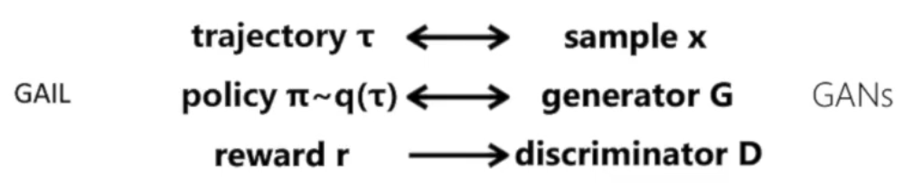

# 2-13 
1. rough任务下，调整网络参数（encoder的层数和维度、frame_stack的大小） 
2. 修改play.py系列文件，使其正常运行。主要问题：相关库的安装；him环境下step的返回值有7个(之前的环境是5个)；data.json系列文件的相对路径写法是按play文件所在目录，而运行时是按命令行工作目录。 
3. rough任务下生成的地形难度太大，应降低难度。查阅terrain相关文件，了解地形生成相关参数。理论上来说，在更困难的任务下，him的表现应该要比est好。 

# 2-14 
## **Diffusion** 数学推导： 
     
扩散模型相比于gan的一大优势是训练稳定：损失函数明确且稳定；gan更容易出现往生成器欺骗判别器的方向训练；对超参数敏感度更低。 
     
训练目的：在已知$x_t$的情况下得到$x_{t-1}$的分布，由此获得$x_0$ 
     

$ q(\mathbf{x}_{t-1} | \mathbf{x}_0) = \sqrt{\bar{\alpha}_{t-1}} \mathbf{x}_0 + \sqrt{1 - \bar{\alpha}_{t-1}} \bar{\mathbf{z}}_{t-1} $ 

$ q(\mathbf{x}_t | \mathbf{x}_0) = \sqrt{\bar{\alpha}_t} \mathbf{x}_0 + \sqrt{1 - \bar{\alpha}_t} \bar{\mathbf{z}}_t $ 

$ q(\mathbf{x}_t | \mathbf{x}_{t-1}, \mathbf{x}_0) = \sqrt{\alpha_t} \mathbf{x}_{t-1} + \sqrt{1 - \alpha_t} \mathbf{z}_{t-1} $ 

$ q(\mathbf{x}_{t-1} | \mathbf{x}_t, \mathbf{x}_0) = q(\mathbf{x}_t | \mathbf{x}_{t-1}, \mathbf{x}_0) \frac{q(\mathbf{x}_{t-1} | \mathbf{x}_0)}{q(\mathbf{x}_t | \mathbf{x}_0)}   
    \propto \exp \left( -\frac{1}{2} \left( \frac{(\mathbf{x}_t - \sqrt{\bar{\alpha}_t} \mathbf{x}_{t-1})^2}{\beta_t} + \frac{(\mathbf{x}_{t-1} - \sqrt{\bar{\alpha}_{t-1}} \mathbf{x}_0)^2}{1 - \bar{\alpha}_{t-1}} - \frac{(\mathbf{x}_t - \sqrt{\bar{\alpha}_t} \mathbf{x}_0)^2}{1 - \bar{\alpha}_t} \right) \right) 
     = \exp \left( -\frac{1}{2} \left( \left( \frac{\alpha_t}{\beta_t} + \frac{1}{1 - \bar{\alpha}_{t-1}} \right) \mathbf{x}_{t-1}^2 - \left( \frac{2 \sqrt{\alpha_t}}{\beta_t} \mathbf{x}_t + \frac{2 \sqrt{\bar{\alpha}_{t-1}}}{1 - \bar{\alpha}_{t-1}} \mathbf{x}_0 \right) \mathbf{x}_{t-1} + C(\mathbf{x}_t, \mathbf{x}_0) \right) \right) $ 
得到$\mathbf{x}_{t-1}$分布的期望： 
     $ \tilde{\mu}_t(\mathbf{x}_t, \mathbf{x}_0) = \frac{\sqrt{\alpha_t} (1 - \bar{\alpha}_{t-1})}{1 - \bar{\alpha}_t} \mathbf{x}_t + \frac{\sqrt{\bar{\alpha}_{t-1}} \beta_t}{1 - \bar{\alpha}_t} \mathbf{x}_0 $ 
      
带入 $ \mathbf{x}_0 = \frac{1}{\sqrt{\bar{\alpha}_t}} \left( \mathbf{x}_t - \sqrt{1 - \bar{\alpha}_t} \bar{\mathbf{z}}_t \right) $ 
      
得到：$ \tilde{\mu}_t = \frac{1}{\sqrt{\alpha_t}} \left( x_t - \frac{\beta_t}{\sqrt{1 - \bar{\alpha}_t}} \bar{z}_t \right) $ 用期望作为$\mathbf{x}_{t-1}$   
$ \bar{z}_t$通过深度学习网络预测得到。 

### Algorithm 1 Training 

1: **repeat** 

2:   $\mathbf{x}_0 \sim q(\mathbf{x}_0)$ 

3:   $t \sim \text{Uniform}(\{1, \ldots, T\})$ 
 
4:   $\epsilon \sim \mathcal{N}(\mathbf{0}, \mathbf{I})$ 

5:   Take gradient descent step on 
     $$ 
     \nabla_\theta \left\| \epsilon - \epsilon_\theta \left( \sqrt{\bar{\alpha}_t} \mathbf{x}_0 + \sqrt{1 - \bar{\alpha}_t} \epsilon, t \right) \right\|^2 
     $$ 

6: **until** converged 

### Algorithm 2 Sampling 

1: $\mathbf{x}_T \sim \mathcal{N}(\mathbf{0}, \mathbf{I})$ 

2: **for** $t = T, \ldots, 1$ **do** 

3:   $\mathbf{z} \sim \mathcal{N}(\mathbf{0}, \mathbf{I})$ if $t > 1$, else $\mathbf{z} = \mathbf{0}$ 

4:   $ 
\mathbf{x}_{t-1} = \frac{1}{\sqrt{\alpha_t}} \left( \mathbf{x}_t - \frac{1 - \alpha_t}{\sqrt{1 - \bar{\alpha}_t}} \epsilon_\theta(\mathbf{x}_t, t) \right) + \sigma_t \mathbf{z} 
   $ 

5: **end for** 

6: **return** $ \mathbf{x}_0 $ 

## **模仿学习** 
### 主要方法： 
1. Behavior Cloning （BC） 
使用监督学习预测expert所给出的action 
2. Inverse Reinforcement Learning （IRL） 
基于expert data学习出一个reward function，让专家轨迹的奖励值是最高的，agent的奖励值较低。大循环：reward function的更新；小循环：agent的策略更新。 
3. Generative Adversarial Imitation Learning （GAIL） 
使agent生成的策略分布接近于专家轨迹 

### recent study 
1. Soft Q Imitation Learning (SQIL): 操作简单、效果还行。   
将专家轨迹对应的reward设置为1，最新的agent交互得到的轨迹对应的reward设置为0。RL算法使用soft Q-learning 或soft Actor-critic(目标函数中添加了策略的熵)。 
2. Random Expert Distillaton(RED):   
和GAIL类似，使agent生成的(s,a)与专家生成的相似。 
3. Disagreement-Regularized IL(DRIL) :   
当前状态越远离专家轨迹中的状态，其策略不确定性会越大。对策略的不确定性(方差)加额外惩罚。 

# 2-18 & 19 
## 训练轮足机器人上楼梯 
1. 将base坐标系下x方向速度对命令速度的追踪相关的奖励函数改为世界坐标系下x方向速度对命令速度的追踪。两腿z方向的奖励函数打开。 
2. 将命令角速度范围设置得极小(0.001)。 
3. 先只训楼梯地形，地形level数要多一点（20,大概一半为斜坡一半为台阶）。学出明显抬腿上楼动作时，再在各种rough地形上训以提高鲁棒性。 
4. 训练时为及时观察机器人是否有抬腿趋向，训练时把headless关闭，在gym的viewer栏中勾选Render collision mesh并按v键暂停画面渲染以提高训练速度，需要查看训练效果时再按v键继续画面渲染。 

使用已训好的网络模型时，确保此时使用的配置文件中决定网络结构和该模型对应。（例如，frame_stack会影响模型的输入层的维度） 

# 2-20 

#### 难绷的问题 
1. 3090ti主机，远程连接（向日葵和todesk）均显示黑屏。应该是显卡驱动问题，无法正常远程显示。 
2. 4060ti主机进行gym训练时显示段错误，开启headless选项后，显示显存不足，存在non-PyTorch memory 占用约7G显存。 

# 2-21 

1. 注意observations中某些特殊观测数据的位置，比如HIM方法中，source encoder会显式地估计base_vel，由于observations中各数据的拼接顺序的变化，导致source encoder实际是对其他的观测数据做的MSE。 
2. 特权观测中对应的obs部分是未加噪、未加延迟的，并不是obs与additional obs的拼接。 
3. 注意actor网络是如何从obs_buf中调取当前的obs的（最新的obs可能是在obs_buf的最后也可能是在最前）。 

# 2-27 
1. 不要加与奖励函数相关的又无意义的观测。例如wheel关节的位置观测，因为它受其速度影响，而其速度又受参考速度影响，参考速度又与相位有关，相位参与了其他奖励函数的计算，而wheel由于速度一直为正，其pos的值也越来越大，这么一个大且与奖励有关的观测很容易影响网络的正常学习。 
2. 对于2x2维张量a，a[0,:]是2维的，a[0:1,:]是1x2维的。 

# 3-1 ~ 3-7 

## 训练轮足平地locomotion任务并部署 
1. 由于转子惯量属性的缺失，导致pd标定时轮子震荡严重。 
2. 部署时使用的网络输出频率高于训练时的频率，导致机器人运行不稳定。 

# 3-11 
训练tips： 在实机部署成功了的config基础上，将某个random范围减小或关闭，再次训练部署，以测试该random的必要性。过滤掉没有必要的random，利于学习到更好的策略网络。 

# 6-9 ~ 6-16 

##  FastTD3 论文 
* 核心理念： 
     1. 并行模拟； 
     2. 大批量更新（2^15的批量大小）； 
     3. 分布式评论家网络（多角度评估价值）； 
     4. 精调的超参数；。 
      
研究发现： 
1. 不同的强化学习算可能需要不同的奖励函数来产生理想的行为。 
2. 没有层归一化的情况下，使用Q值的最小值（而非平均值）通常表现更好。 
3. 不需要使用残差路径或层归一化等额外的架构稳定器，因为大批量训练和并行模拟已经减少了更新的不稳定性。 

# 6-26 
## Q&A 
使用强化学习训练机器狗进行后空翻动作时，常常需要用到“多阶段分奖励设置”，为了防止由于各阶段奖励不平衡导致的value爆炸等情况，常会将各阶段进行独热编码输入给critic，这能起到怎样的作用，如果训练多个critic网络来评估各个阶段的状态value能否起到比较好的效果 

* 回答： 
     对于一个普通的Critic网络，输入同样（或相似）的状态 s 却要它输出截然不同的价值，这会让网络非常“困惑”。它必须从其他微小的状态差异中去推断当前处于哪个阶段，这非常困难，导致学习到的价值函数在阶段切换时产生剧烈震荡，也就是你提到的 “value爆炸”或不稳定的前兆。 
     *  **独热编码作为输入的作用**： 
     **消除状态的歧义性** (Disambiguation)：网络现在接收到的输入是 (状态, 上下文)。对于上面那个例子，输入变成了 (s, [1, 0, 0]) 和 (s, [0, 0, 1])。这是两个完全不同的输入，Critic可以轻易地为它们学习两个不同的价值输出，完美解决了歧义性问题。 
     **平滑价值函数** ：Critic不再需要学习一个全局的、在阶段边界处有“断崖式”跳变的价值函数。它可以被看作是在学习多个条件价值函数（V(s | stage=1), V(s | stage=2)...）。在每个阶段内部，价值函数的变化是平滑且连续的，这极大地降低了学习难度。 
     **提升学习稳定性和效率** ：由于学习目标（TD-target）变得更加稳定和一致，价值损失的方差会减小，整个训练过程会更加稳定。网络可以将一部分参数用于学习通用的状态特征，另一部分参数（通常是更高层）根据独热编码的输入来“切换”到对应阶段的价值评估模式，实现了参数的有效利用。 

     * **多critic的优缺点**： 
     **优点**： 
     完全解耦 (Complete Decoupling)：这是最大的优点。每个Critic都是一个独立的专家，它们之间的学习完全没有干扰。如果各个阶段的价值函数形态差异极大，这种方法理论上可以达到比单网络+独热编码**更好**的隔离效果。概念简单：每个网络只负责一件事，逻辑上非常清晰。 
     **缺点**： 
     参数效率低下 (Parameter Inefficiency)：这是最主要的问题。机器狗的动力学模型、状态表示的底层物理含义在所有阶段都是共通的。使用多个独立的网络意味着这些共通的底层特征（比如关节如何影响速度，速度如何影响位置）需要在每个Critic网络中被重复学习。而单网络+独热编码的方法可以在网络的底层共享这些通用特征，只是在高层根据上下文进行特化，参数效率高得多。 
     数据稀疏性问题 (Data Sparsity)：每个Critic只使用1/N的数据进行训练。如果某个阶段特别短（比如起跳瞬间），那么对应的Critic能获得的训练样本就会很少，可能导致其学习不充分。 
     阶段切换时的价值不连续：当从阶段 i 切换到阶段 i+1 时，critic_i 评估的终点价值和 critic_{i+1} 评估的起点价值可能存在巨大的鸿沟。这会给优势函数的计算（尤其是GAE中的多步回报）带来麻烦，可能重新引入不稳定性。你需要设计精巧的机制来处理这种跨网络的价值引导（bootstrapping）。 
     实现和管理更复杂：你需要管理多个网络、多个优化器（或者一个优化器更新不同部分），以及一个路由逻辑，增加了工程复杂性。 
     即： 
          1.多个critic共通的底层特征被重复学习； 
          2.各个阶段的训练数据比例不平衡，有些critic学习不充分； 
          3.阶段切换时，value的评价差异大容易导致return（回报）的计算不稳定； 
          4.多个网络管理复杂。 

# 6-27 
* Go2 locomotion训练value loss暴增，报错：RuntimeError: normal expects all elements of std >= 0.0 ： 
1. 将log_std剪裁到-20到20之间；学习率从1.0e-3改为1.0e-4(防止更新权重过大，“跨过”损失函数谷底),gammma从0.99改为0.98(防止长episode中，累积return方差过大导致的value_loss不稳定),max_grad_norm从1.0改为0.8(减小梯度更新的最大值),减小entropy_coef（奖励损失函数中鼓励探索的权重） 
2. 对observation进行归一化处理，额外加了一个orientation的终止条件 
4096个环境，15000轮训练中未再出现该报错 

# 6-29 
* 有趣的写法： 
policy = lambda x: self.alg.policy.act_inference(self.obs_normalizer(x)) 
张量和Numpy矩阵可以使用[..., a:b]进行切片，表示取最后一个维度的a到b的元素 

# 7-2 
* 使用isaaclab.sh脚本进行强化学习库安装时存在的问题： 
     1. 该脚本会搜索extensions文件目录下的一级子目录下的setup.py文件进行${python_exe} -m pip install --editable \$1 (\$1是setup所在目录)安装。 
     2. 实际上是通过 pip 的 extras_require 机制，从 GitHub 下载 rsl_rl 的源码并直接安装到 Python 的 site-packages 目录（无法实现editable效果）。 
     3. 当本地pip install -e .安装时，发现rsl_rl库始终指向旧版本（site packages目录下），无法更新。可以在执行pip uninsatall rsl_rl后，将site packages目录下的rsl_rl*文件夹删除，再重新pip install -e . 
     4. 发现./isaaclab.sh --install rsl_rl指定安装rsl_rl库时，由于对应的github仓库的包名已经改为rsl-rl-lib，导致报错。运行./isaaclab.sh --install安装所有强化学习库时，pip 会尝试安装所有依赖，即使有些部分包名不一致也可能被“容忍”或被其他依赖间接安上。 

# 7-3 
* 对于某实例化类a，a中的方法return_b，是通过@property装饰器定义的，其内容是返回b属性。 
该方法返回的是只读属性，a.return_b是a.b的引用，b是张量这种可变类型，可以通过a.return_b.copy()来修改a.b的内容。 
若b是可变类型数据，则可通过对a.return_b的索引赋值来修改a.b的内容，例如a.return_b[:] = ...  ；若b是不可变类型数据，则不可。 

* 各种形式的奖励函数的适用场景 
     指数型：适合需要较为精确的目标跟踪； 
     平方型：对大误差敏感；(如倾斜角度) 
     L1/L2型：（如角速度，action） 
     对数型、sigmoid/tanh型 

# 7-5 
## 训狗日志： 
* 将action_rate、action_l2、action_somoothness的权重增大，并对其进行clip裁剪（裁剪的值根据tensorboard中对应奖励项的平均值来确定），缩小剪裁区间可以避免梯度爆炸、避免过于关注大误差而忽略小误差。同时将dof的加速度惩罚权重也增大。 
     * 训练结果：行走高度降低，不容易翻到了，但是仍存在抖动问题，并且能跨过平台的高度降低。 

* **在地形中添加离散随机的凸起小平台，以鼓励机器狗学会抬脚.** 
     * 在原有配置下训练崩溃，机器狗东倒西歪。 
* **对斜坡地形附加rough地形** 
     * 后腿的高度偏低，向后退时不太会抖动了；转向时容易抖动，在rough地形上反而容易抖动摔倒。 
* **参照himloco中的代码编写了feet_clearance奖励函数** 
     * 似乎更不容易摔了，但是抬腿能力下降（可能是奖励函数中设定的抬脚高度-0.2过低），当脚卡在障碍处走不动时，容易出现抖动。 
* **将feet_clearance奖励目标高度改为-0.18，楼梯地形的阶梯高度范围到0.03~0.2** 
     * 正常行走时（尤其是后退时）更容易抖了，抬腿能力提升。训练到八千多轮出现value loss爆炸。 
* 增加域随机化 

# 7-6 
* onmi/isaac/lab目录下terrains文件夹的文件结构： 
     * height_field、trimesh等文件实现各类地形的具体生成逻辑。（height_field地形实际是通过trimesh实现的，通过调用utils中将配置文件格式转换的方法@height_field_to_mesh） 
     * generator调用height_field、trimesh等文件，生成地形mesh信息存入其terrain_mesh属性。 
     * importer将地形mesh信息传入import_mesh方法，生成仿真环境中的地形，configure_env_origins方法指定各地形块上机器人的初始位置。还有是否启用地形可视化、导入平面地形等方法。 

# 7-8 
## @configclass的作用： 
@configclass是Isaaclab用于简化配置类的装饰器。 
1. 无需手写___init__方法，可以直接将属性在类中定义，装饰器自动生成__init__方法。 
2. 支持特殊功能，如.copy()方法、.to_dict()方法（将配置类转为字典）、递归合并、序列化等。 
3. 文档友好，可以对各个属性使用"""  """来进行文档注释。 

# 7-9 
## 循环import的问题： 
循环import的问题，即A依赖B，B依赖A，那么就会产生循环依赖，程序崩溃。 
解决方法： 
     1. 当A需要使用到B中的属性/方法时，在函数内部进行导入。 
     2. 为了A文件中能有正常的类型提示和检查，使用如下写法，这样静态类型检查器分析代码时,TYPE_CHECKING为True，程序运行时，TYPE_CHECKING为False。 
     `import typing ` 
     `if typing.TYPE_CHECKING:` 
     `     from PathToB import B` 

# 8-19 
## offline-to-online 的RL场景的特点 

     其核心目标是：利用一个预先收集好的、不与环境交互的“离线数据集”（offline dataset）来加速后续的在线学习过程，从而显著提高样本效率。
	Offline Rl的“悲观性”来源和影响：
		offline RL会主动压低未知的状态-动作对的价值估计。（称为 策略悲观或价值函数保守）
		导致探索意愿被抑制，容易陷入局部最优，在线学习过程收集的数据质量不高导致样本效率低下。

## 动作序列评估和决策 在offline-to-online RL场景的作用
	1. 单一动作过于离散，更容易出现分布外（out of distribution, OOD）的数据；而有意义的动作序列往往遵循特定模式，离线数据更可能覆盖大部分类型的动作序列，OOD数据类型更少。
	2. 离线数据（如人类演示数据等）往往是具有非马尔可夫特性的（决策动作与历史状态有关），使用动作序列来建模这些非马尔可夫行为，能够更好地吸收离线数据。
	3. 动作序列的时间一致性能让智能体走出局部状态，实现更高效的探索。
	4. 细粒度地预测单步动作容易过拟合噪声，预测动作序列时，优化目标更平滑，更容易收敛。
	
# 8-22 
## 模仿学习
1. 使用离线数据进行学习，记录与环境交互时遇到的数据分布外的情况，人工进行标注，更新数据，重新训练。
2. 逆强化学习(Inverse RL, IRL)，通过一系列专家行为数据，学习出潜在的奖励函数。
 IRL的优势主要有： 自动学习隐含的奖励结构；泛化性强；较好地避免reward hacking；
 经典方法 最大熵逆强化学习（2008年）：在所有能“解释”专家行为的奖励函数中，选择不确定性（熵）最大的，以避免学到过拟合、奇怪的奖励。
3. GAIL，借鉴GAN(生成式对抗网络)的思想，策略网络输出与专家轨迹相似输出以欺骗判别器。
 
