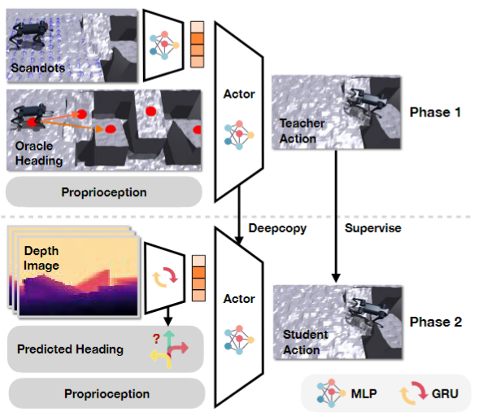

CTS: concrrent teacher student(2024)

HIM: Hybrid Internal Model (2024)

RMA: Rapid Motor Adaptation (2021)
Adapation Module用于估计环境信息，部署时频率为10hz，其输入岂不是0.1秒前拿到的观测，训练时它与环境交互时的输出频率应该如何；并且Adapation Module的输入需要50帧的观测，环境初始时观测的初始化是为0，这对训练的影响会有多大。

Challenging Terrains using Egocentric Vision

DWL : Denoising World Model Learning

AMP: Adversarial Motion Priors (2023)

Extreme Parkour (2024, ICRA)

DreamWaQ(Vae):Dream Walking for Quadrupedal Robots  (2023) 